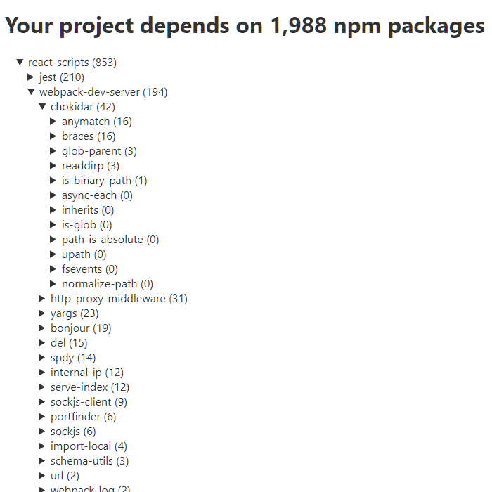

# list-html

To run:
```
npx list-html
```

This will run `npm list` in your current project, and show the results as an expandable tree in you browser.

Each node shows the package name and the total number of dependencies (including dependencies of dependencies) for each package.

The shape of the tree is defined by the [npm ls command](https://docs.npmjs.com/cli/v6/commands/npm-ls).

<p align="center">
  
</p>

